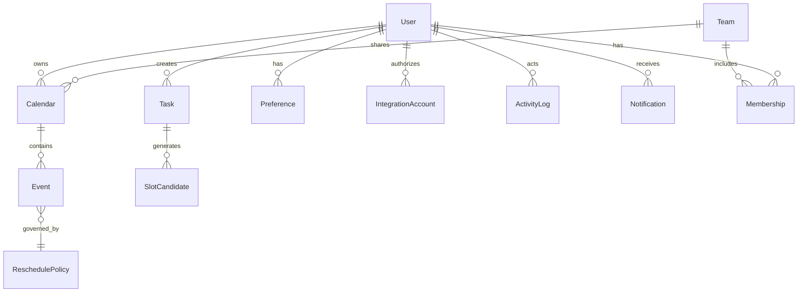
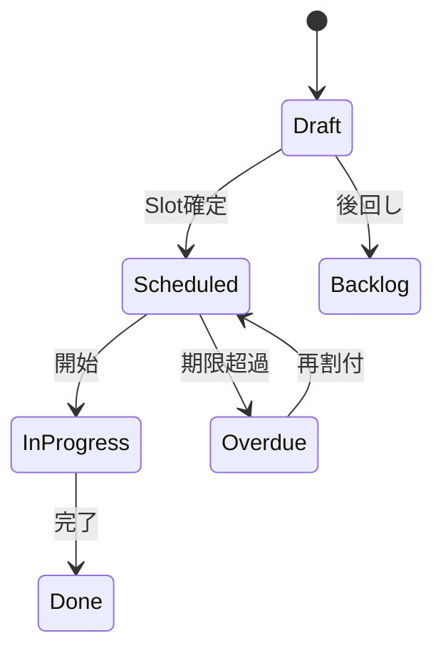

# スケジュールコンシェルジュ アーキテクチャドキュメント

バージョン: 0.1 (初稿)
作成日: 2025-08-11

---
## 1. 目的 / 非目的
### 1.1 目的
- 個人および小規模チームのタスク/予定の統合管理 (カレンダー + ToDo + リソース調整)。
- 利用者の“空き時間”と“集中可能時間”を自動抽出し、最適スロットをレコメンド。
- マルチデバイス (iPhone / Web) で一貫したUX とオフライン耐性。
- 外部カレンダー (Google / Microsoft 365)・タスク (Jira / GitHub Issues) との統合。
- 時間ブロッキング・優先度・エネルギーレベル / コンテキストタグによる賢い自動再配置 (Auto-Reschedule)。
- AI アシスタントによる自然言語入力 ("来週水曜の午前に 90 分の集中作業を確保") から構造化イベント生成。

### 1.2 非目的
- 大規模 (>500 人) エンタープライズ向け複雑な権限制御。
- フル機能のプロジェクト管理 (ガント / WBS / コスト管理)。
- 医療・金融など厳格な規制準拠領域向け専用要件。
- リアルタイムチャット / コミュニケーションプラットフォーム化。

---
## 2. 対象ユーザ
| ペルソナ | 特徴 | 課題 | 価値提供 |
|----------|------|------|-----------|
| 個人プロフェッショナル | フリーランス/副業 | タスク分散と時間確保難 | 集中時間ブロック自動化 |
| スタートアップ小規模チーム | 2-20 名 | 会議過多 / 衝突調整 | 衝突回避と最適スロット提案 |
| 知的作業者 (ナレッジワーカー) | 深い集中が必要 | コンテキスト切替コスト高 | エネルギー/タグ基づき再配置 |
| マネージャ | 複数メンバー予定把握 | チーム空き時間探索 | 集合可用スロット抽出 |

---
## 3. ユースケース一覧
| ID | タイトル | 概要 | 主要アクター | 優先 | 備考 |
|----|----------|------|-------------|------|------|
| UC01 | 自然言語で予定登録 | "明日10時から30分レビュー"入力 | ユーザ | High | AI 解析 |
| UC02 | 空き時間レコメンド | 優先タスクに最適時間提案 | ユーザ | High | スコアリング |
| UC03 | 衝突解消自動再配置 | ダブルブッキング自動調整 | システム | High | 期限/優先度考慮 |
| UC04 | 外部カレンダー同期 | 双方向同期 | システム | High | Webhook / Push |
| UC05 | 集合可用時間探索 | N 人の空き集合 | ユーザ | Medium | OR検索最適化 |
| UC06 | フォーカスモード保護 | 集中時間中の会議挿入防止 | システム | High | ルール判定 |
| UC07 | タスク→スロット自動割付 | 未スケジュールタスク自動ブロック | システム | High | バッチ/イベント駆動 |
| UC08 | 優先度/エネルギー再評価 | 朝に再計算し並び替え | システム | Medium | ML 余地 |
| UC09 | iPhone オフライン編集 | ローカル変更後で同期 | ユーザ | Medium | CRDT / ローカルDB |
| UC10 | アクティビティログ監査 | 操作履歴照会 | 管理者 | Low | 90日保持 |
| UC11 | SLA / ステータス監視 | ヘルスダッシュボード | SRE | Medium | メトリクス可視化 |
| UC12 | OAuth 連携管理 | 連携追加/削除/再認可 | ユーザ | High | Token Refresh |

---
## 4. ドメインモデル
### 4.1 主要エンティティ
- User: 認証主体 (個人/チームメンバー)。
- Calendar: 内部仮想カレンダー (複数) + 外部同期メタ。
- Event: 時間ブロック (会議 / Focus / Buffer)。
- Task: 実行すべき仕事 (所要時間, 期限, 優先度, Energyタグ)。
- SlotCandidate: 推薦候補 (Taskと時間帯候補のマッピング)。
- AvailabilityWindow: 利用可能時間 (就業時間・除外時間を正規化)。
- IntegrationAccount: 外部API認可状態 (Google, Microsoft, Jira 等)。
- ReschedulePolicy: 自動再配置ルール (優先度, 締切, 移動許容量)。
- ActivityLog: 監査ログ。
- Notification: 配信キュー (メール / Push / Webhook)。
- Team / Membership: 共有/可視性境界。
- Preference: ユーザ設定 (言語 / タイムゾーン / Focus保護レベル)。

### 4.2 関係 (Mermaid)


### 4.3 状態遷移例 (Task)


### 4.4 Slot レコメンドスコア要素
- 締切逼迫度 (Due Proximity)
- 優先度 (Priority)
- 連続集中可能時間との適合 (Block Fit)
- エネルギーレベル同期（朝型/午後集中型）
- コンテキスト切替コスト (Context Switching Penalty)
- 会議密度バランス (Meeting Load Balance)

---
## 5. 外部インターフェース
### 5.1 API (REST + GraphQL Read)
- Auth: /auth/login(OAuth)、/auth/refresh
- Tasks: CRUD, bulk import
- Events: CRUD, move, focus-protect
- Recommendations: /slots/suggest?taskId=xxx
- Integrations: /integrations/{provider}/connect, /disconnect
- Team: /teams, /teams/{id}/members
- Webhook Management: /webhooks (subscribe/unsubscribe)
- Health: /healthz, /readiness, /metrics (Prometheus)

### 5.2 Webhook
| イベント | ペイロード主要項目 | リトライ | セキュリティ |
|----------|------------------|---------|------------|
| task.created | taskId,userId,priority | Exponential(5) | HMAC-SHA256署名 |
| task.updated | diff(before,after) | 同上 | 同上 |
| event.rescheduled | eventId,oldSlot,newSlot | 同上 | 同上 |
| integration.token.expiring | provider,expiresAt | 同上 | 同上 |
| recommendation.generated | taskId,slots[] | 同上 | 同上 |

### 5.3 OAuth 権限スコープ
| Provider | Scope | 用途 |
|----------|-------|------|
| Google | calendar.readonly, calendar.events | 予定参照/作成 |
| Microsoft | Calendars.Read, Calendars.ReadWrite | 同上 |
| Jira | read:issue, write:issue | タスク同期 |
| GitHub | repo, read:user | Issue→Task 取り込み |

### 5.4 iPhone アプリ同期
- ローカルSQLite + BackgroundTasks + Push 通知 (silent push) で差分取得。
- 競合解決: Vector Clock + Last-Writer-Wins (一部フィールド) / Merge (Tag集合)。

---
## 6. アーキテクチャ概要
```mermaid
flowchart LR
  subgraph Client
    A[iOS App SwiftUI]
    B[Web SPA (React/Next)]
  end
  subgraph Edge
    CDN[(CDN/Cache)]
    WAF[WAF]
  end
  subgraph Backend Cluster
    APIGW[API Gateway]
    AuthS[Auth Service]
    TaskS[Task Service]
    EventS[Event Service]
    RecS[Recommendation Engine]
    SyncS[External Sync Service]
    NotifS[Notification Service]
    Sched[Async Scheduler]
  end
  subgraph Data
    DB[(PostgreSQL)]
    Cache[(Redis Cluster)]
    MQ[(Kafka / NATS)]
    Obj[(S3 Compatible)]
    Search[(OpenSearch)]
  end
  A --> APIGW
  B --> APIGW
  APIGW --> AuthS
  APIGW --> TaskS
  APIGW --> EventS
  APIGW --> RecS
  APIGW --> SyncS
  APIGW --> NotifS
  TaskS --> DB
  EventS --> DB
  RecS --> Cache
  RecS --> MQ
  SyncS --> MQ
  MQ --> Sched
  Sched --> EventS
  Sched --> TaskS
  NotifS --> MQ
  MQ --> NotifS
  TaskS --> Search
  EventS --> Search
  SyncS --> External[(Google/M365/Jira/GitHub)]
```

---
## 7. 品質特性
### 7.1 性能
- P95 API レイテンシ < 300ms (Read) / < 500ms (Write)
- 推薦生成: バックグラウンドは 5s SLA、オンデマンド呼び出しは 1.5s 以内
- キャッシュ: ユーザ日次可用窓 (TTL 5m)、タスク統計 (TTL 30s)
- インデックス: (user_id, start_at), (task_id, due_at)

### 7.2 可用性
- ターゲット: 99.9% 月間 (SLO)
- フェイルオーバ: PostgreSQL マルチAZ + 自動昇格
- Retry パターン: Exponential + Jitter (最大 3)
- サーキットブレーカー: 推薦エンジン/外部API

### 7.3 セキュリティ
- OAuth 2.1 / OIDC + PKCE
- 保存時暗号化: KMS 管理鍵 (PostgreSQL TDE + S3 SSE)
- 転送暗号化: TLS1.3, HSTS, WAF + Bot対策
- RBAC (ユーザ/チーム単位) + Row Level Security (PostgreSQL RLS)
- Secret 管理: Vault
- 脅威: Token漏洩, API乱用, Webhook偽造, Replay攻撃
- 対策: 短命 Access + Refresh Rotation, Rate Limit, HMAC署名検証, Nonce + Timestamp検査

### 7.4 運用・監視
- Metrics: RED + USE (Prometheus)
- Tracing: OpenTelemetry (Jaeger)
- Logging: 構造化JSON + 30日保持 (低コスト階層化)
- アラート: レイテンシSLO違反、Webhook失敗率、外部同期遅延、再スケジュール失敗量
- フィーチャーフラグ: LaunchDarkly 互換 (DBベース簡易実装可)

### 7.5 拡張性 / モジュラリティ
- サービス境界: Task / Event / Recommendation / Sync / Notification
- 増加負荷: 推薦計算をキュー分離 + 水平スケール

### 7.6 モバイルオフライン
- 差分同期 (timestamp + tombstone)
- 変更キュー flush 成功時 ack

---
## 8. データ保持 & PITR
| データ種別 | 保持期間 | アーカイブ | 削除要求 (GDPR) | PITR 対象 |
|------------|----------|-----------|-----------------|-----------|
| Task/Event 主テーブル | 永続 | 18ヶ月後コールド | 速やか (論理削除→物理) | Yes |
| ActivityLog | 90日 | 以降削除 | 対象外 | No |
| Notification Logs | 30日 | 以降削除 | 対象外 | No |
| OAuth Tokens | 有効期限+7日 | なし | 即時 | No |
| バックアップ | 35日ローテーション | Glacier (S3) | N/A | Yes |

- PITR: WAL 連続アーカイブ + 5分粒度リカバリ目標。
- 外部検索インデックスは再構築 (Source of Truth=DB)。

---
## 9. リスクと代替案
| リスク | 影響 | 緩和策 | 代替案 |
|--------|------|--------|--------|
| 推薦アルゴリズム初期精度低 | UX低下 | ルールベース + A/B | まずは手動微調整提案 |
| 外部API Rate Limit | 同期遅延 | バックオフ + 増分差分 | キャッシュ + スロットリング |
| モバイルオフライン競合 | データ不整合 | CRDT + マージ戦略 | LWW単純化 (整合性優先) |
| データモデル過度分割 | 複雑性増 | 段階的分離 | 単一サービス開始 |
| 再スケジュール失敗ループ | CPU浪費 | リトライ上限 + DLQ | 人手審査キュー |
| 機密情報流出 (Webhook) | 情報漏洩 | HMAC + IP allowlist | Polling fallback |
| トークン失効一括 | 同期停止 | Refresh分散化 | Grace/再試行ウィンドウ |

---
## 10. 受け入れ条件 (MVP)
| 項目 | 条件 |
|------|------|
| ユーザ登録/認証 | OIDCログイン + Refresh動作 |
| タスクCRUD | API + Web/iOS UI 反映 |
| 予定作成/編集 | 外部カレンダーへ反映 (Google) |
| 推薦スロット | 1.5s以内 80% ケース |
| 自動再配置 | ダブルブッキング検知し再提案 |
| オフライン編集 | iOSで30分圏内変更同期 |
| Webhook配信 | 95%< 60秒以内配信 |
| 監査ログ | 主要操作 (作成/更新/削除) 記録 |
| セキュリティ | 基本OWASP Top10 対策済 |

---
## 11. E2E テスト観点
- 認証: 新規ログイン / Refresh / 無効トークン拒否
- タスク: 作成→推薦→スケジュール→更新→完了
- 予定: Google連携→双方向同期 (外部更新反映)
- 推薦: 締切/優先度/エネルギータグ違いで順位変化
- 衝突解消: 重複イベント投入→再配置提案確認
- オフライン: 機内モードで編集→復帰同期
- Webhook: task.updated 署名検証 + リトライ
- セキュリティ: RLS越境アクセス試行拒否
- PITR: 意図的削除後 時点復旧 (Staging)
- 性能: 同時100ユーザの推薦API SLA測定

---
## 12. 採用しない案 (理由)
| 案 | 不採用理由 |
|----|------------|
| 単一巨大モノリス | 推薦計算負荷スパイクで全体影響 |
| 全イベント駆動 (CQRS + EventSourcing) | 初期スコープ過大・学習コスト |
| 強い整合性DBロックで衝突防止 | スループット低下/デッドロックリスク |
| クライアント完全P2P同期 | 複雑・マルチデバイス検証困難 |
| GraphQL全面採用 | 書き込み複雑化 + キャッシュ戦略難 |
| ML全面導入 (初期) | データ不足 + チューニング負荷 |
| Gantt/高度PM機能 | MVP範囲超過 |

---
## 13. 今後の拡張ロードマップ (参考)
- フェーズ1: MVP (タスク/イベント統合 + 推薦 + Google同期)
- フェーズ2: チーム共有 / 集合可用時間 / Microsoft 365 対応
- フェーズ3: 学習ベース優先度調整 / Slack連携通知
- フェーズ4: ML最適化 (個人集中パターン学習)

---
## 付録: 主要テーブル概要 (簡易)
| テーブル | 主キー | 主要カラム | 備考 |
|----------|--------|-----------|------|
| users | id | timezone, locale | RLS主体 |
| tasks | id | user_id, due_at, priority, energy_tag, status | インデックス(due_at, priority) |
| events | id | calendar_id, user_id, start_at, end_at, type | インデックス(start_at) |
| calendars | id | user_id, external_provider, external_id | 同期状態 |
| integration_accounts | id | user_id, provider, scopes, refresh_token_hash | 失効管理 |
| slot_candidates | id | task_id, start_at, score | 一時/TTL |
| reschedule_policies | id | user_id, rules(jsonb) | ルール表現 |
| activity_logs | id | user_id, action, entity, entity_id, created_at | 監査 |
| notifications | id | user_id, channel, status, payload | 再送制御 |

---
(以上)
