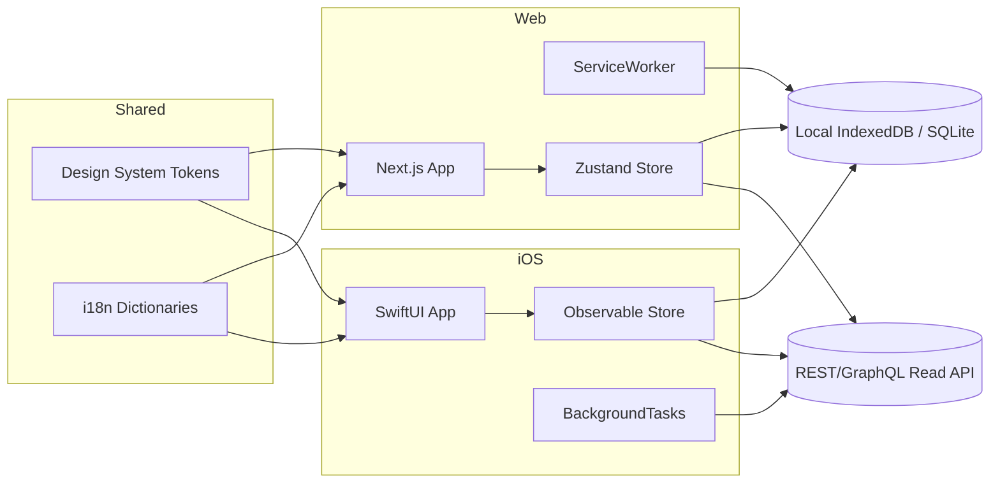
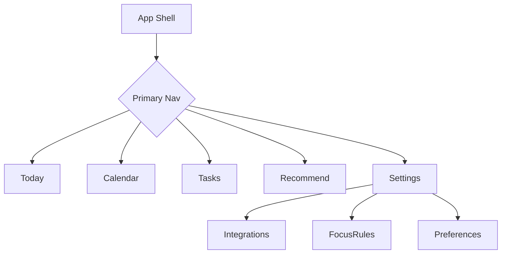
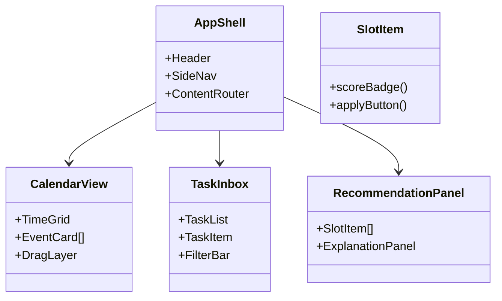
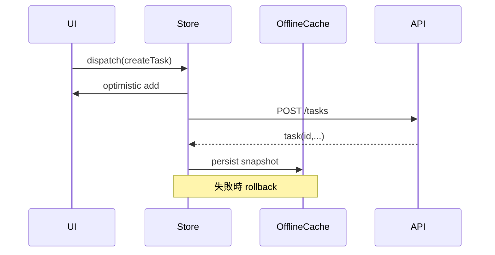
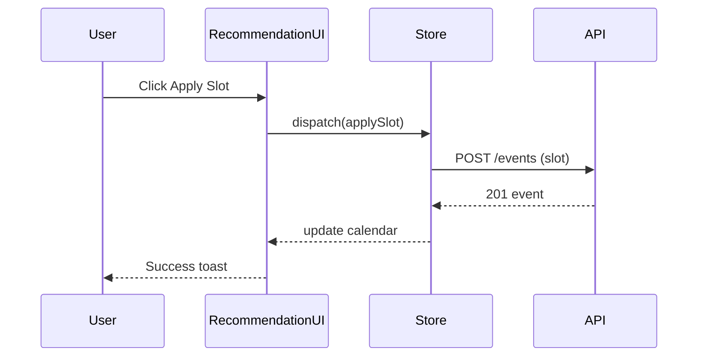
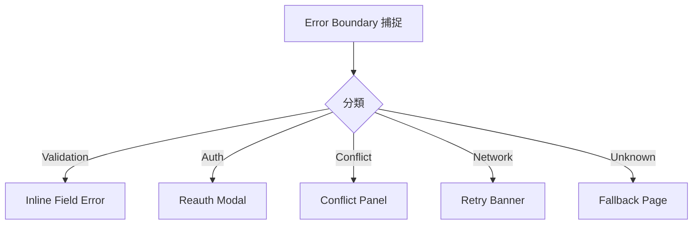
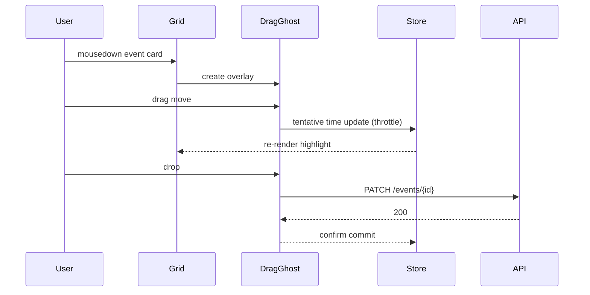

# フロントエンド設計ドキュメント (v0.1)
作成日: 2025-08-12
対象: Web (React/Next.js 想定) / iOS (SwiftUI) 両チャネル共通設計
想定ページ分量: B5相当 約12ページ (文字ベース)

---
## 1. 目的 / 非目的
### 1.1 目的
- 時間・タスク・集中ブロックの統合視覚化と操作効率最大化
- クロスプラットフォーム (Web / iPhone) で一貫した情報構造と操作モデル
- オフライン編集 (iPhone) と最小コンフリクト UI
- 予定・タスクの自然言語入力体験 (NLP API 呼び出し) の高速化
- レコメンド (スロット提案) の理解容易性 (理由説明, スコア可視化)
- アクセシビリティ (WCAG 2.1 AA 相当) と i18n 対応

### 1.2 非目的
- macOS / Android ネイティブ同時リリース (将来検討)
- 高度なプロジェクトビュー (ガント / カンバン統合) 第一段階では非対応
- オフライン全文検索 (最初はサーバ依存)

---
## 2. ペルソナと UX 原則
| ペルソナ | 主要行動 | UX 原則 |
|----------|---------|---------|
| 個人プロ | 毎朝スケジュール調整 | 「今日の集中時間」即時可視化 |
| チームメンバ | 会議調整 | 衝突/空きスロット比較を 3クリック以内 |
| マネージャ | チーム可用性把握 | 集合空き時間の要約カード |

UX 原則:
1. Time First: 時間軸がナビゲーションの脊椎
2. Cognitive Load 削減: 一画面 1 コア判断
3. Explainable Recommendation: なぜそのスロットか根拠表示
4. Latency 感知閾値 <100ms (体感即応) で主要操作の楽観 UI

---
## 3. 全体アーキテクチャ (フロント観点)

---
## 4. 主要ビュー構成
| ビュー | 目的 | 主要要素 | 交互機能 |
|--------|------|----------|----------|
| Today Dashboard | 当日の集中/会議/タスク指標 | 集中ブロック, KPI バー | レコメンド適用, タスク昇格 |
| Calendar (Week/Day) | 時間配置閲覧/編集 | 時間グリッド, イベントカード | DnD 移動, 衝突表示 |
| Task Inbox | 未スケジュール管理 | タスクリスト, フィルタ | Bulk 推薦, 優先度調整 |
| Recommendation Panel | スロット候補理解 | 候補リスト, スコア詳細 | 適用, 非採用理由選択 |
| Integration Settings | 外部連携制御 | Provider カード | OAuth Connect/Disconnect |
| Focus Protection Rules | 保護レベル管理 | ルール一覧 | 追加/編集/適用テスト |
| Audit (後期) | 操作履歴 | ログテーブル | フィルタ/エクスポート |

---
## 5. 情報アーキテクチャ / ナビゲーション

- モバイル: Bottom Tab (Today/Calendar/Tasks/Settings) + Sheet (Recommend)
- Web: 左サイドバー (アイコン + ラベル), 推薦パネルは右ドッキング

---
## 6. コンポーネント階層 (Web 例)

---
## 7. 状態管理設計
### 7.1 分類
| ストア | スコープ | 例 | 同期方式 |
|--------|---------|----|---------|
| UI Ephemeral | 一時表示 | モーダル開閉 | React useState / SwiftUI State |
| Domain Cache | セッション | tasks, events | Zustand / ObservableObject |
| Persisted Offline | オフライン | delta queue | IndexedDB / CoreData(SQLite) |
| Derived/Selector | 計算値 | 今日残集中時間 | メモ化 Selector |

### 7.2 データフロー (Web)

---
## 8. オフライン同期 (iOS 中心)
| 要素 | 方法 | 詳細 |
|------|------|------|
| ローカルDB | SQLite (CoreData) | tasks/events テーブル + version |
| 差分送信 | バッチ API /sync/upload-delta | 失敗時指数バックオフ |
| 競合判定 | version + field-level merge | text fields: LWW, tags: set union |
| UI 表示 | ConflictBanner | 手動解決リンク |

---
## 9. API 対応レイヤ
| 層 | 役割 | 例 |
|----|------|----|
| Fetch Adapter | 認証ヘッダ, リトライ | fetchWithAuth |
| Repository | ドメインモデル変換 | TaskRepository.getById |
| Service Hook | React Hook で状態バインド | useTask(id) |
| View | 表示/操作 | TaskDetailCard |

### 9.1 エラーマッピング
| HTTP | UI 表示 | リトライ | 追跡タグ |
|------|--------|--------|---------|
| 400/422 | 入力エラートースト | ユーザ修正 | validation_error |
| 401 | 再ログインモーダル | トークン再取得 | auth_error |
| 409 | 衝突解決パネル | 操作後 | conflict |
| 429 | バックオフトースト | 自動 | rate_limit |
| 5xx | 再試行バナー | 自動+手動 | server_error |

---
## 10. 推薦 UX と説明性
### 10.1 Slot リスト表示要素
| 要素 | 説明 |
|------|------|
| 時間帯 | 開始〜終了 (ローカルTZ) |
| スコアバッジ | 0.00–2.00 の色階層 (緑>黄>赤) |
| 締切距離 | 期限までの残時間 (hrs) |
| エネルギーマッチ | ✓/△/× アイコン |
| コンテキスト切替コスト | アイコン (低/中/高) |

### 10.2 適用フローシーケンス

---
## 11. パフォーマンス / 最適化
| 項目 | 目標 | 手法 |
|------|------|------|
| 初回 LCP | < 2.5s | SSR + critical CSS inline |
| 交互応答 | < 100ms | 楽観更新 + バッチ描画抑制 |
| スクロール FPS | 55–60fps | 仮想リスト (タスク>200) |
| バンドルサイズ初期 | < 250KB gzip | Code splitting route-based |
| 推薦再計算レンダ | < 50ms | メモ化 + Diff Patch |

Lazy Load: NLP モジュール, 設定画面, 推薦説明パネル

---
## 12. アクセシビリティ / i18n
| 項目 | 対策 |
|------|------|
| キーボード操作 | Tab 順序定義, focus ring 明示 |
| ARIA | EventCard role=button + aria-describedby |
| コントラスト | 4.5:1 以上 (AA) / 3:1 Large Text |
| 多言語 | ICU メッセージ (format.js) / Swift Foundation Formatter |
| 日付/時間 | TZ 切替反映 (ユーザ設定) |
| モード | ライト/ダーク + High Contrast Palette |

---
## 13. セキュリティ / プライバシー (フロント特有)
| リスク | 対策 |
|-------|------|
| XSS | Content-Security-Policy strict, React 自動エスケープ徹底 |
| CSRF | JWT (Authorization header) 方式 + Safe Method 限定 |
| Token 盗難 | Secure Storage (iOS Keychain / Web: httpOnly クッキー) |
| PII ログ露出 | Console ログマスク / Error Boundary で除去 |
| Webhook secret 表示 | UI 不表示 (•••) + Reveal 確認ダイアログ |

---
## 14. エラーハンドリング UX

- グローバル ErrorBoundary: 予期しない例外 → セッション継続可能性評価
- 冪等操作 (適用/移動) は失敗時差分ロールバック

---
## 15. ビルド / デプロイ
| 項目 | Web | iOS |
|------|-----|-----|
| ビルド | Next.js (App Router) | Xcode (Swift 6) |
| CI | Lint + Unit + E2E (Playwright) | Unit + UI Tests |
| 配信 | CDN Edge Cache | App Store / TestFlight |
| Feature Flag | Remote JSON / env embed | 同一 (URL fetch) |
| バージョン | SemVer + commit hash | CFBundleShortVersion + build |

---
## 16. テスト戦略
| レイヤ | Web | iOS |
|-------|-----|-----|
| 単体 | Jest(Logic), Vitest可 | XCTest (ViewModel) |
| コンポーネント | React Testing Library | SwiftUI Preview Snapshot |
| E2E | Playwright | XCUITest (主要フロー) |
| Visual Reg | Chromatic (差分) | Snapshot 比較 |
| パフォ | Lighthouse CI | Instruments (Time Profiler) |
| Accessibility | axe-core | XCTest + VoiceOver Script |

シナリオ例 (E2E):
1. タスク作成→推薦→適用→カレンダー反映
2. FOCUS ブロック追加→重複会議挿入→警告表示
3. オフライン切断→編集→再接続同期
4. OAuth 連携追加→外部更新反映

---
## 17. デザインシステム / トークン
| カテゴリ | 例 | 命名 |
|----------|----|------|
| Color | primary/secondary/focusBlock | color.primary.500 |
| Spacing | 4,8,12,16,... | space.4 | 
| Typography | heading/body/mono | font.size.sm |
| Elevation | card, overlay | elevation.card |
| Radius | sm/md/lg | radius.md |
| Motion | fast(120ms)/base(200ms) | motion.fast |

テーマ切替: CSS Variables (Web) / SwiftUI Environment Values (iOS)

---
## 18. 主要インタラクション DnD (カレンダー)

Optimistic: 失敗時 元位置へアニメーション戻し

---
## 19. メトリクス / 観測性 (フロント)
| 種類 | 指標 | 送信先 |
|------|------|--------|
| UX | LCP/FID/CLS | RUM Collector |
| パフォ | API latency (navigationStart->responseEnd) | OpenTelemetry Web SDK |
| 動作 | SlotApplySuccess / Fail | Analytics (匿名) |
| エラー | JS Error, Promise rejection | Error Tracker |
| 機能 | FocusProtectionBlockCount | Analytics |

サンプリング: RUM 10%, エラー 100%

---
## 20. リスクと対策
| リスク | 影響 | 対策 |
|--------|------|------|
| レコメンド遅延 >1.5s | UX 不満 | Skeleton / 部分Streaming |
| DnD モバイル操作性低 | 誤操作 | Long-press Delay + Haptic Feedback |
| オフライン競合頻発 | 信頼低下 | 差分プレビュー + Undo |
| 多言語翻訳遅延 | ローカライズ遅れ | 初期は英/日 2 言語に絞る |
| メモリ使用過多 (大量イベント) | ブラウザ劣化 | ウィンドウ仮想化 + calendar range clamp |

---
## 21. 今後の拡張ロードマップ (Front)
| フェーズ | 追加機能 |
|---------|---------|
| 1 | 基本タスク/カレンダー/推薦/FOCUS 保護表示 |
| 2 | 集合可用時間 (複数ユーザ重ね表示) |
| 3 | 推薦理由の自然言語説明カード |
| 4 | ML パーソナライズ学習状況ダッシュボード |
| 5 | オフライン Smart Prefetch (次日分) |

---
## 22. 品質ゲート (Front 特有)
| 項目 | 基準 |
|------|------|
| Lint | ESLint + TypeScript no error |
| Unit Coverage | 70% 以上 (Critical modules 80%) |
| Lighthouse Perf | >= 85 | 
| Lighthouse Accessibility | >= 90 |
| Bundle 初回 | < 250KB gzip main | 
| E2E 主要シナリオ | 100% Green | 

---
## 23. 参考技術選定理由
| 項目 | 選定 | 代替 | 理由 |
|------|------|------|------|
| Next.js | SSR + ルーティング | Remix | エコシステム & ISR |
| Zustand | 軽量状態管理 | Redux Toolkit | ボイラープレート低減 |
| IndexedDB Dexie | オフライン高速クエリ | localForage | よりリレーショナルユースパターン適合 |
| SwiftUI | 宣言的 UI | UIKit | 保守性/スピード |
| OpenTelemetry Web | 観測性統合 | Sentry Span API | ベンダ中立 |

---
## 24. 付録: コンポーネント命名ガイド
| 種 | 接頭辞 | 例 |
|----|-------|----|
| プレゼンテーション | `Xxx` | TaskItem |
| コンテナ | `XxxContainer` | TaskListContainer |
| Hook | `useXxx` | useTasks |
| サービス | `xxxService` | recommendationService |
| 型 | `XxxDto` / `XxxModel` | TaskModel |

---
(以上)
