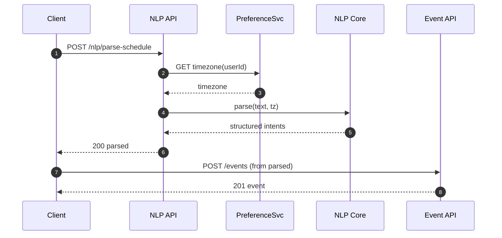
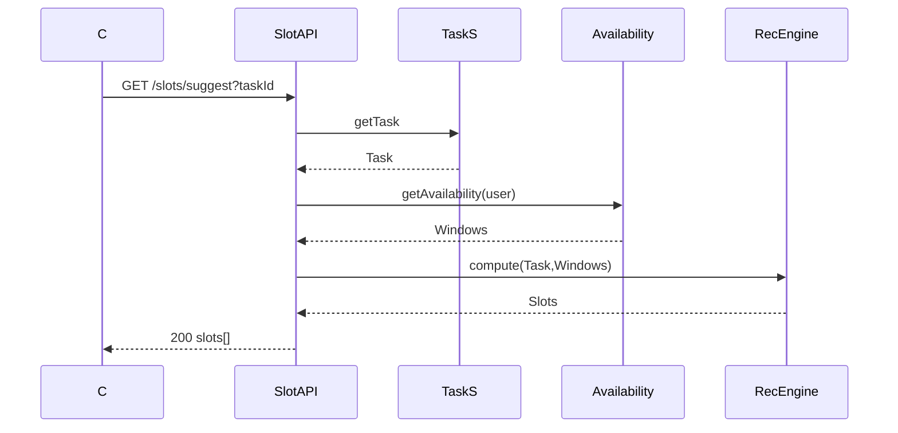
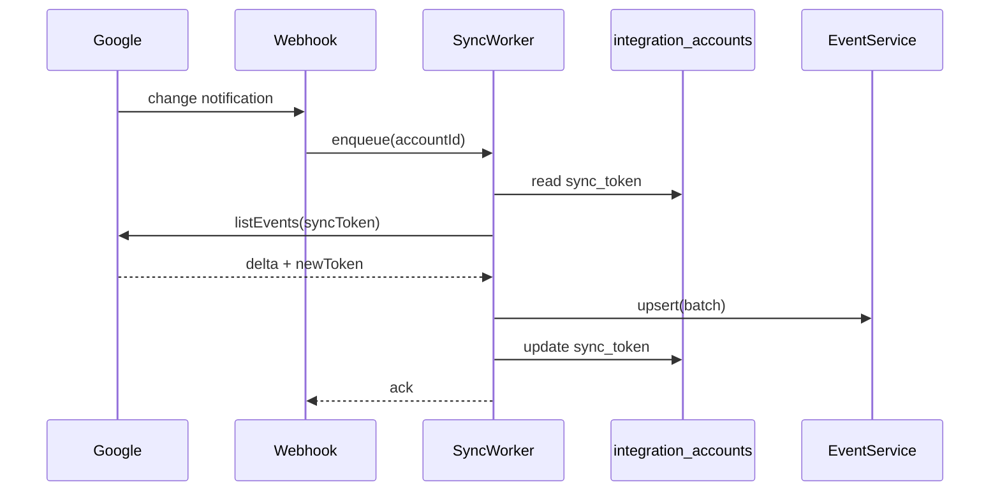
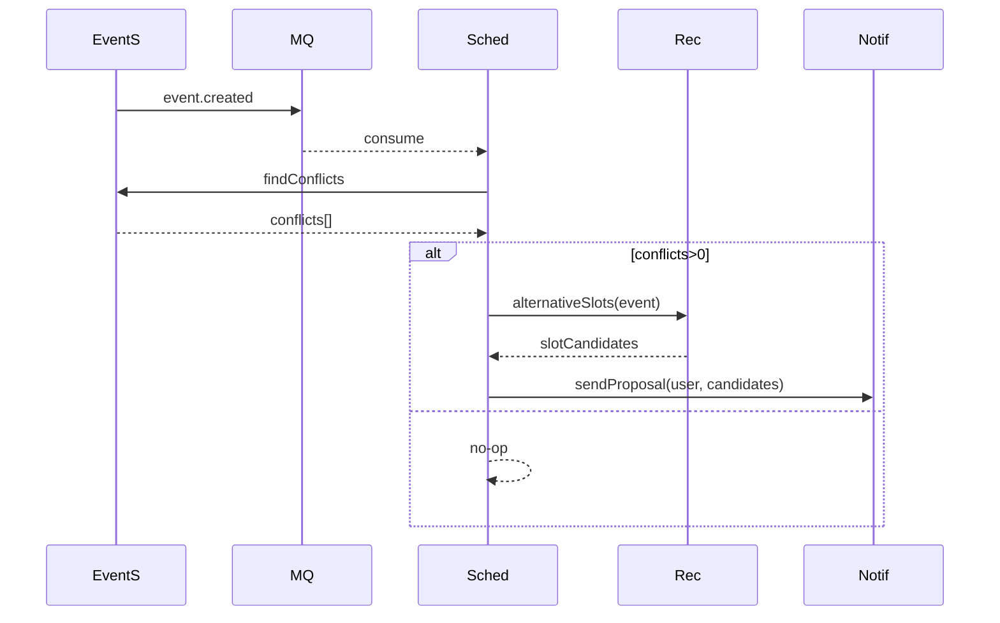
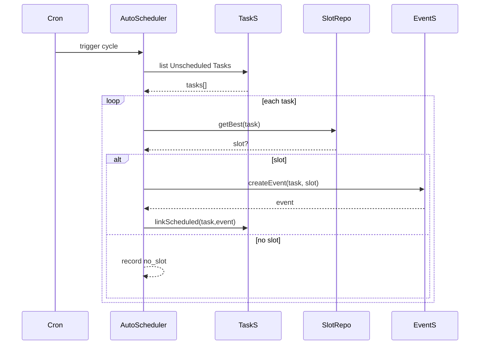
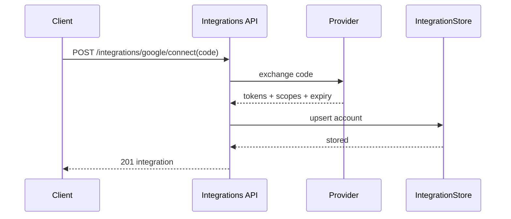

# 技術詳細仕様 (Technical Specification) v0.1
作成日: 2025-08-11

本書: 追加詳細 (ER属性定義 / 詳細シーケンス図 / 非機能指標根拠 / HTTP例外マッピング / OpenAPI スキーマ / 疑似コード)。

---
## 1. ER 属性定義
型略記: PK=主キー, FK=外部キー, NN=NOT NULL, UQ=UNIQUE, IDX=索引, DEF=default

### 1.1 users
| 属性 | 型 | 制約 | 説明 |
|------|----|------|------|
| id | UUID | PK | 論理主体 |
| email | TEXT | NN,UQ,IDX(lower(email)) | ログインID (将来 SSO) |
| timezone | TEXT | NN | 例: "Asia/Tokyo" |
| locale | TEXT | NN | i18n (ja-JP 等) |
| created_at | timestamptz | NN,DEF now() | 生成日時 |
| deleted_at | timestamptz | NULL | 論理削除 |

### 1.2 tasks
| 属性 | 型 | 制約 | 説明 |
|------|----|------|------|
| id | UUID | PK | |
| user_id | UUID | FK→users.id,IDX | 所有者 |
| title | TEXT | NN | 件名 |
| description | TEXT | NULL | 詳細 |
| due_at | timestamptz | NULL,IDX | 期限 |
| priority | smallint | NN,DEF 3 | 静的優先度 (1高) |
| dynamic_priority | smallint | NULL,IDX | 再計算優先度 |
| energy_tag | TEXT | NULL | morning/deep 等 |
| status | TEXT | NN,DEF 'Draft',IDX | Draft/Backlog/Scheduled/InProgress/Done/Overdue |
| estimated_minutes | int | NULL | 見積り |
| scheduled_event_id | UUID | FK→events.id | 割当イベント |
| version | int | NN,DEF 0 | 衝突検出 |
| created_at | timestamptz | NN,DEF now() | |
| updated_at | timestamptz | NN,DEF now() | |

### 1.3 calendars
| 属性 | 型 | 制約 | 説明 |
| id | UUID | PK | |
| user_id | UUID | FK users,IDX | 所有者 |
| name | TEXT | NULL | 表示用 |
| external_provider | TEXT | NULL,IDX | google/m365 等 |
| external_id | TEXT | NULL,IDX | 外部カレンダー識別子 |
| created_at | timestamptz | NN | |

### 1.4 events
| 属性 | 型 | 制約 | 説明 |
| id | UUID | PK | |
| calendar_id | UUID | FK calendars,IDX | 所属 |
| user_id | UUID | FK users,IDX | 所有ユーザ |
| title | TEXT | NN | |
| description | TEXT | NULL | |
| start_at | timestamptz | NN,IDX | 開始 |
| end_at | timestamptz | NN | 終了 |
| type | TEXT | NN,DEF 'GENERAL',IDX | GENERAL/FOCUS/MEETING/BUFFER |
| recurrence_rule | TEXT | NULL | iCal RRULE (将来) |
| external_event_id | TEXT | NULL,IDX | 外部連携ID |
| created_at | timestamptz | NN | |
| updated_at | timestamptz | NN | |

### 1.5 integration_accounts
| 属性 | 型 | 制約 | 説明 |
| id | UUID | PK | |
| user_id | UUID | FK users,IDX | 所有 |
| provider | TEXT | NN,IDX | google/m365/jira/github |
| scopes | TEXT[] | NN | 付与スコープ |
| access_token_hash | TEXT | NN | Hash化保存 |
| refresh_token_hash | TEXT | NULL | 同上 |
| expires_at | timestamptz | NN | Access失効 |
| sync_token | TEXT | NULL | 増分同期トークン |
| created_at | timestamptz | NN | |
| updated_at | timestamptz | NN | |
| revoked_at | timestamptz | NULL | 無効化 |

### 1.6 slot_candidates
| 属性 | 型 | 制約 | 説明 |
| id | bigserial | PK | |
| task_id | UUID | FK tasks,IDX | 対象タスク |
| start_at | timestamptz | NN | 候補開始 |
| end_at | timestamptz | NN | 候補終了 |
| score | numeric(5,4) | NN,IDX | 評価 |
| expires_at | timestamptz | NN,IDX | TTL 管理 |
| created_at | timestamptz | NN | |

### 1.7 conflict_resolutions
| 属性 | 型 | 制約 | 説明 |
| id | bigserial | PK | |
| event_id | UUID | FK events,IDX | 対象イベント |
| detected_at | timestamptz | NN | 検知時刻 |
| conflict_count | int | NN | 衝突件数 |
| proposals | jsonb | NULL | 代替案集合 |
| status | varchar(16) | NN,DEF 'PROPOSED' | PROPOSED/ACCEPTED/REJECTED |

### 1.8 activity_logs
| 属性 | 型 | 制約 | 説明 |
| id | bigserial | PK | |
| user_id | UUID | FK users,IDX | 行為主体 |
| action | TEXT | NN,IDX | create/update/delete/login 等 |
| entity | TEXT | NN | タスク/イベント 等 |
| entity_id | UUID | NULL | 対象ID |
| meta | jsonb | NULL | 追加情報 (差分等) |
| created_at | timestamptz | NN,IDX | |

---
## 2. 詳細シーケンス図

### 2.1 NLP → Event 作成フロー


### 2.2 スロット推薦


### 2.3 外部カレンダー増分同期


### 2.4 自動再配置プロポーザル


### 2.5 Task→Slot 自動割付サイクル


### 2.6 OAuth Connect


---
## 3. 非機能数値の根拠
| 項目 | 数値 | 根拠/計算 |
|------|------|-----------|
| P95 読取 300ms | 300ms | 典型: 認証(5) + キャッシュ/DB (40) + App処理(50) + ネット往復(80) + 余裕 | 
| P95 書込 500ms | 500ms | トランザクション/インデックス更新追加 ( +150ms ) |
| 推薦同期 1.5s | 1.5s | 可用窓取得(150ms) + スロット探索(最大 300ms) + スコアリング(タスク長~5*50ms) + 余裕 |
| 推薦非同期 5s | 5s | バッチ (複数タスク並列) + 背景再計算許容量 |
| SLO 99.9% | 年間許容停止 ≈ 8h45m/年 | 中小チーム向け SaaS 標準水準 |
| バックアップ保持 35日 | 35 | 月跨ぎ復旧要求 + 誤削除検出期間 |
| PITR 5分粒度 | 5分 | WAL S3 アーカイブコスト vs RPO バランス |
| 監査ログ 90日 | 90 | 法令/軽量監査要件 & ストレージコスト制御 |
| オフライン同期遅延 30分以内 | 30 | モバイル利用 (移動時間) UX 期待値 |

計算例 (API レイテンシ余裕): 平均ハンドラ CPU 50ms, p95 = 平均 * 3 (Burst) ≈ 150ms, ネット + TLS 往復 80ms, DB p95 40ms → 270ms ≈ 300ms 目標妥当。

---
## 4. HTTP 例外マッピング詳細
共通レスポンス:
```json
{ "error": { "code": "TASK_NOT_FOUND", "message": "Task not found", "traceId": "abc123" } }
```

| HTTP | 用途 | 代表コード | 説明 |
|------|------|-----------|------|
| 400 | クライアント入力不正 | VALIDATION_ERROR / OAUTH_CODE_INVALID | スキーマ/パラエラー |
| 401 | 未認証 | AUTH_ERROR | トークン不備または失効 |
| 403 | 権限不足 | FORBIDDEN | 他ユーザリソースアクセス |
| 404 | 存在しない | TASK_NOT_FOUND / EVENT_NOT_FOUND | ID 不正 |
| 409 | 競合 | VERSION_CONFLICT / FOCUS_PROTECTED | 楽観ロック/フォーカス保護 |
| 422 | 意味的エラー | NLP_INVALID_TIME | 値は形式正しいが意味不成立 |
| 429 | レート超過 | RATE_LIMIT | RateLimitError |
| 502 | 外部依存失敗 | EXTERNAL_ERROR | Upstream 失敗 |
| 503 | 一時不可 | RETRYABLE | 再試行期待 |
| 504 | タイムアウト | GATEWAY_TIMEOUT | 依存遅延 |

エラーフィールド拡張: `details` (配列), `retryAfter` (秒), `hint` (短いヒント)

---
## 5. OpenAPI 3.1 スキーマ (抜粋)
```yaml
openapi: 3.1.0
info:
  title: Schedule Concierge API
  version: 0.1.0
servers:
  - url: https://api.example.com
components:
  securitySchemes:
    bearerAuth:
      type: http
      scheme: bearer
      bearerFormat: JWT
  schemas:
    Error:
      type: object
      properties:
        error:
          type: object
          properties:
            code: { type: string }
            message: { type: string }
            traceId: { type: string }
            details: { type: array, items: { type: string } }
          required: [code,message]
    Task:
      type: object
      properties:
        id: { type: string, format: uuid }
        title: { type: string }
        dueAt: { type: string, format: date-time, nullable: true }
        priority: { type: integer, minimum: 1, maximum: 5 }
        dynamicPriority: { type: integer, nullable: true }
        energyTag: { type: string, nullable: true }
        status: { type: string, enum: [Draft,Backlog,Scheduled,InProgress,Done,Overdue] }
        estimatedMinutes: { type: integer, nullable: true }
        version: { type: integer }
      required: [id,title,status,priority,version]
    Event:
      type: object
      properties:
        id: { type: string, format: uuid }
        title: { type: string }
        startAt: { type: string, format: date-time }
        endAt: { type: string, format: date-time }
        type: { type: string, enum: [GENERAL,FOCUS,MEETING,BUFFER] }
      required: [id,title,startAt,endAt,type]
    SlotSuggestion:
      type: object
      properties:
        startAt: { type: string, format: date-time }
        endAt: { type: string, format: date-time }
        score: { type: number }
      required: [startAt,endAt,score]
    SlotSuggestionResponse:
      type: object
      properties:
        taskId: { type: string }
        slots:
          type: array
          items: { $ref: '#/components/schemas/SlotSuggestion' }
      required: [taskId,slots]
paths:
  /tasks:
    post:
      security: [ { bearerAuth: [] } ]
      requestBody:
        required: true
        content:
          application/json:
            schema:
              type: object
              properties:
                title: { type: string }
                dueAt: { type: string, format: date-time, nullable: true }
                priority: { type: integer }
                estimatedMinutes: { type: integer, nullable: true }
              required: [title]
      responses:
        '201':
          description: created
          content:
            application/json:
              schema: { $ref: '#/components/schemas/Task' }
        '400': { description: invalid, content: { application/json: { schema: { $ref: '#/components/schemas/Error' } } } }
  /slots/suggest:
    get:
      security: [ { bearerAuth: [] } ]
      parameters:
        - name: taskId
          in: query
          required: true
          schema: { type: string }
        - name: limit
          in: query
          schema: { type: integer, default: 5, minimum: 1, maximum: 20 }
      responses:
        '200': { description: ok, content: { application/json: { schema: { $ref: '#/components/schemas/SlotSuggestionResponse' } } } }
        '404': { description: not found, content: { application/json: { schema: { $ref: '#/components/schemas/Error' } } } }
  /events:
    post:
      security: [ { bearerAuth: [] } ]
      requestBody:
        required: true
        content:
          application/json:
            schema:
              type: object
              properties:
                calendarId: { type: string }
                title: { type: string }
                startAt: { type: string, format: date-time }
                endAt: { type: string, format: date-time }
                type: { type: string }
                overrideFocusProtection: { type: boolean, default: false }
              required: [calendarId,title,startAt,endAt]
      responses:
        '201': { description: created, content: { application/json: { schema: { $ref: '#/components/schemas/Event' } } } }
        '409': { description: focus protected, content: { application/json: { schema: { $ref: '#/components/schemas/Error' } } } }
  /integrations/{provider}/connect:
    post:
      parameters:
        - in: path
          name: provider
          required: true
          schema: { type: string }
      requestBody:
        required: true
        content:
          application/json:
            schema:
              type: object
              properties:
                code: { type: string }
                redirectUri: { type: string }
              required: [code,redirectUri]
      responses:
        '201': { description: ok }
        '400': { description: invalid, content: { application/json: { schema: { $ref: '#/components/schemas/Error' } } } }
```

---
## 6. 疑似コード (Pseudocode)
### 6.1 recommendation_service.compute_slots
```python
def compute_slots(task, availability_windows, limit=5):
    required = task.estimated_minutes or default_estimate(task)
    candidates = []
    for win in availability_windows:
        # slide window in block granularity (e.g., 15m)
        cursor = align_to_quarter(win.start)
        while cursor + minutes(required) <= win.end:
            end = cursor + minutes(required)
            ctx = build_context(task, cursor, end)
            score = score_slot(ctx)  # combines priority, due proximity, energy fit, context switching
            if focus_conflict(cursor, end):
                score *= 0.7
            candidates.append((cursor, end, score))
            cursor += minutes(15)
    # pick top N distinct (avoid adjacency duplicates)
    top = select_top_distinct(candidates, limit)
    persist_slot_candidates(task.id, top)
    return top
```

### 6.2 availability_service.intersect_free
```python
def intersect_free(users, range):
    # fetch busy blocks per user (sorted)
    busy_map = {u: get_busy_blocks(u, range) for u in users}
    merged_busy = merge_union(busy_map.values())  # O(n log n)
    free = complement(range, merged_busy)
    # ensure min gap >= threshold
    return [w for w in free if (w.end - w.start) >= MIN_DURATION]
```

### 6.3 scheduler.handle_event_created
```python
def handle_event_created(event_id):
    event = event_repo.get(event_id)
    conflicts = event_repo.find_conflicts(event.user_id, event.start_at, event.end_at, exclude=event.id)
    if not conflicts:
        return
    slots = rec_engine.alternative_slots(event)
    conflict_repo.record(event.id, len(conflicts), slots)
    notification.send(event.user_id, type='RESCHEDULE_PROPOSAL', payload={'eventId': event.id, 'slots': slots})
```

### 6.4 sync.google_sync.pull_events
```python
def pull_events(account):
    token = oauth.ensure_valid(account)
    delta, new_sync_token = google.list_events(token, account.sync_token)
    internal_events = [map_external(e) for e in delta]
    event_repo.batch_upsert(internal_events)
    account.sync_token = new_sync_token
    integration_repo.save(account)
```

### 6.5 focus_guard.validate
```python
def validate(event, existing_events, override=False):
    if event.type == 'FOCUS':
        return  # focus block itself
    for e in existing_events:
        if e.type == 'FOCUS' and overlaps(event, e):
            if override:
                metrics.focus_overrides.inc()
                return
            raise ConflictError(code='FOCUS_PROTECTED', message='Focus time protected')
```

### 6.6 nlp_service.parse
```python
def parse(text, user_tz):
    tokens = tokenize(text)
    dt_candidates = datetime_extractor(tokens, user_tz)
    if not dt_candidates:
        raise ValidationError(code='NLP_INVALID_TIME')
    intent = intent_classifier.predict(text)
    confidence = intent.score
    if intent.type == 'create_event':
        event = build_event_structure(dt_candidates, text)
    else:
        event = None
    return ParseResult(intents=[intent], events=[event] if event else [])
```

### 6.7 oauth_service.exchange_code
```python
def exchange_code(provider, code, redirect_uri):
    resp = http.post(provider.token_endpoint, data={...})
    if resp.status != 200:
        raise ValidationError(code='OAUTH_CODE_INVALID')
    tokens = parse_tokens(resp.json)
    if not required_scopes(tokens.scopes):
        raise ValidationError(code='OAUTH_SCOPE_MISSING')
    hashed = hash_token(tokens.access_token)
    integration_repo.upsert(user_id=current_user.id, provider=provider, data={
        'access_token_hash': hashed,
        'refresh_token_hash': hash_token(tokens.refresh_token),
        'scopes': tokens.scopes,
        'expires_at': tokens.expires_at,
    })
    metrics.oauth_connect_success.inc()
    return tokens
```

---
## 7. 追加テレメトリ実装方針
| 種類 | ライブラリ | 備考 |
|------|------------|------|
| Metrics | prometheus_client | multiprocess Mode for Gunicorn |
| Tracing | OpenTelemetry SDK + OTLP exporter | Collector 経由 Jaeger |
| Logging | structlog or python-json-logger | Correlation: trace/span IDs |

---
## 8. セキュリティヘッダ標準
| ヘッダ | 値 |
|--------|----|
| Content-Security-Policy | default-src 'self' |
| X-Content-Type-Options | nosniff |
| X-Frame-Options | DENY |
| Referrer-Policy | strict-origin-when-cross-origin |
| Strict-Transport-Security | max-age=63072000; includeSubDomains; preload |

---
## 9. 今後検討 (拡張)
- events.recurrence_rule 実装時: 展開 vs オンデマンド判定戦略
- score_slot ML 化: オンライン特徴 (直近集中度) + オフライン特徴 (歴史的成功率)
- SlotCandidate 永続方式: Redis Stream への移行可能性

(以上)
