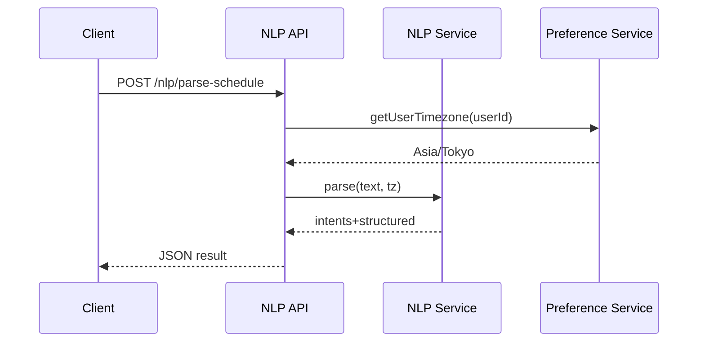
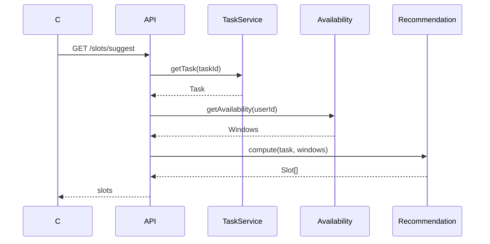
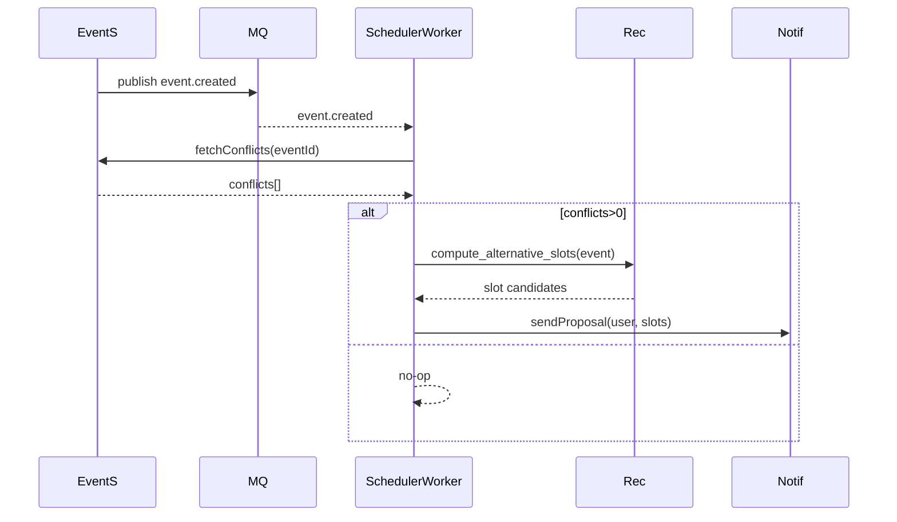
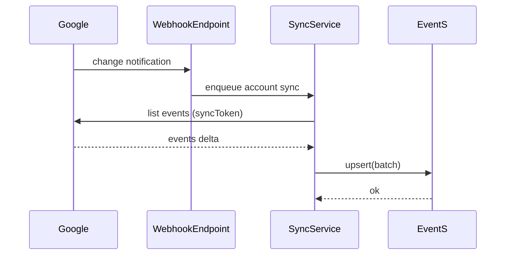
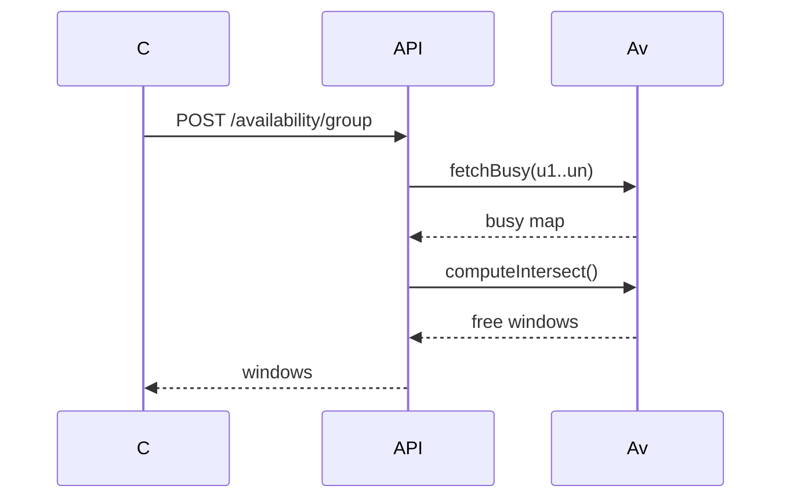

# ユースケース詳細設計 (v0.1)
作成日: 2025-08-11

対象: アプリ MVP ユースケース UC01–UC12

## 記法 / 共通ガイド
- 言語: JSON (camelCase) / DB: snake_case
- エラーフォーマット (共通): `{ "error": { "code": "TASK_NOT_FOUND", "message": "...", "traceId": "..." } }`
- トレース: W3C Trace Context (traceparent) 受け入れ & 発行
- ログレベル方針: セキュリティ / PII は `user_id` ハッシュ化 (sha256+pepper)
- メトリクス命名: `sc.*` prefix (例: `sc.api.tasks.create.latency_ms`)
- リクエストID: `X-Request-Id` (なければ生成)

---
## UC01 自然言語で予定登録
### 目的
自然言語文字列 → 構造化 Event/Task 作成

### 入出力 IF (HTTP)
- `POST /nlp/parse-schedule`
Request:
```json
{ "input": "明日10時から30分レビュー" }
```
Response 200:
```json
{ "intents": [ { "type": "create_event", "confidence": 0.93 } ], "events": [ { "title": "レビュー", "startAt": "2025-08-12T10:00:00+09:00", "endAt": "2025-08-12T10:30:00+09:00", "calendarId": "primary" } ], "tasks": [] }
```
Follow-up create: `POST /events` with returned event.

### 主要関数 / ファイル
| ファイル | 関数 | 役割 |
|----------|------|------|
| `backend/api/nlp.py` | `parse_schedule(req: ParseReq) -> ParseResult` | 入口 |
| `backend/services/nlp_service.py` | `extract_datetime(text, user_tz)` | 日時抽出 |
| 同 | `class IntentClassifier` | 意図分類 |
| `backend/services/event_builder.py` | `build_event(tokens, spans)` | Event構築 |

### シーケンス


### DB スキーマ/マイグレーション (該当: events 作成前提)
`migrations/0002_add_nlp_tables.sql` (例)
```sql
-- events は 0001 で作成済前提
CREATE TABLE IF NOT EXISTS nlp_parse_logs (
  id BIGSERIAL PRIMARY KEY,
  user_id UUID NOT NULL,
  raw_text TEXT NOT NULL,
  intents JSONB NOT NULL,
  created_at TIMESTAMPTZ NOT NULL DEFAULT now()
);
CREATE INDEX ON nlp_parse_logs (user_id, created_at DESC);
```

### エラーハンドリング
| コード | HTTP | 条件 |
|--------|------|------|
| NLP_INVALID_TIME | 422 | 日時抽出失敗 |
| NLP_LOW_CONFIDENCE | 200 | 信頼度 <0.5 (警告フィールド追加) |

### ログ
- INFO: parsed intents, confidence (丸め)
- DEBUG: トークン列 (PII 除去)
- WARN: low confidence

### メトリクス
- Counter: `sc.nlp.parse.requests_total`
- Histogram: `sc.nlp.parse.latency_ms`
- Gauge: `sc.nlp.parse.low_confidence_ratio` (集計ジョブ)

### テスト
Unit:
- `tests/unit/services/test_nlp_service.py::test_extract_datetime_simple`
- `...::test_low_confidence_classification`
Integration:
- `tests/integration/test_nlp_parse_api.py::test_parse_review_event`
Edge:
- 不正フォーマット, タイムゾーン違い

---
## UC02 空き時間レコメンド
### IF
`GET /slots/suggest?taskId=...&limit=5`
Response:
```json
{ "taskId":"t123", "slots":[ {"startAt":"...","endAt":"...","score":0.83} ] }
```

### 関数/ファイル
| ファイル | 関数 |
|----------|------|
| `backend/api/slots.py` | `suggest_slots(task_id, limit)` |
| `backend/services/recommendation_service.py` | `compute_slots(task, windows)` |
| 同 | `score_slot(context)` |
| `backend/services/availability_service.py` | `get_availability(user_id, range)` |

### シーケンス


### スキーマ
`slot_candidates` (一時): TTL -> Redis or RDB
```sql
CREATE TABLE IF NOT EXISTS slot_candidates (
  id BIGSERIAL PRIMARY KEY,
  task_id UUID NOT NULL REFERENCES tasks(id) ON DELETE CASCADE,
  start_at TIMESTAMPTZ NOT NULL,
  end_at TIMESTAMPTZ NOT NULL,
  score NUMERIC(5,4) NOT NULL,
  expires_at TIMESTAMPTZ NOT NULL,
  created_at TIMESTAMPTZ NOT NULL DEFAULT now()
);
CREATE INDEX ON slot_candidates (task_id);
CREATE INDEX ON slot_candidates (expires_at);
```

### エラー
| コード | HTTP | 条件 |
| TASK_NOT_FOUND | 404 | task 不在 |
| NO_AVAILABILITY | 200 | slots=[] |
| INVALID_STATE | 409 | task.status != Draft/Backlog |

### ログ
- INFO: slots_generated count
- DEBUG: top3 scores
- WARN: computation_timeout

### メトリクス
- Histogram: `sc.recommendation.compute.latency_ms`
- Counter: `sc.recommendation.empty_results_total`
- Gauge: `sc.recommendation.queue_depth` (バックグラウンド)

### テスト
Unit:
- `test_recommendation_service.py::test_score_slot_weights`
Integration:
- `test_slots_api.py::test_suggest_basic`
Load:
- 100 同時要求で P95 <1.5s

---
## UC03 衝突解消自動再配置
### IF
- イベント作成/更新後 非同期トリガー `event.created` (MQ)
- 内部: `Scheduler` が重複検出し `event.reschedule_proposal` 生成

### 関数/ファイル
| ファイル | 関数 |
|----------|------|
| `backend/workers/scheduler.py` | `handle_event_created(evt)` |
| 同 | `detect_conflicts(event)` |
| 同 | `propose_new_slot(event)` |
| `backend/services/event_service.py` | `update_event_time(id, slot)` |

### シーケンス


### スキーマ
衝突メタ記録(監査):
```sql
CREATE TABLE IF NOT EXISTS conflict_resolutions (
  id BIGSERIAL PRIMARY KEY,
  event_id UUID NOT NULL REFERENCES events(id) ON DELETE CASCADE,
  detected_at TIMESTAMPTZ NOT NULL DEFAULT now(),
  conflict_count INT NOT NULL,
  proposals JSONB,
  status VARCHAR(16) NOT NULL DEFAULT 'PROPOSED'
);
CREATE INDEX ON conflict_resolutions (event_id, detected_at DESC);
```

### エラー
- 冪等: 同一イベント短時間二重処理 → ignore (INFO)
- 外部APIダウン: degrade (WARN + Retry)

### ログ
- INFO: conflict_count
- WARN: proposal_generation_failed
- ERROR: notify_failed

### メトリクス
- Counter: `sc.reschedule.conflicts_detected_total`
- Histogram: `sc.reschedule.proposal.latency_ms`
- Counter: `sc.reschedule.failures_total`

### テスト
Unit: detect_conflicts (境界: 重なり=exact, 包含, 部分)
Integration: event create -> proposal message

---
## UC04 外部カレンダー同期
### IF
- OAuth 設定後: `POST /integrations/google/sync` (初期同期)
- Webhook (Google push notifications) 受信: `POST /webhook/google`

### 関数
| ファイル | 関数 |
|----------|------|
| `backend/services/sync/google_sync.py` | `pull_events(account, since)` |
| 同 | `push_event(local_event)` |
| 同 | `map_external_to_internal(e)` |
| 同 | `schedule_incremental_sync()` |

### シーケンス (外部→内部)


### スキーマ
`integration_accounts` に `sync_token TEXT NULL` 列追加。
```sql
ALTER TABLE integration_accounts ADD COLUMN IF NOT EXISTS sync_token TEXT;
```

### エラー
| コード | 条件 |
|--------|------|
| INTEGRATION_UNAUTHORIZED | refresh 失敗 |
| RATE_LIMIT | 429 外部応答 |
| DELTA_TOKEN_INVALID | sync_token 破損 → フル再取得 |

### メトリクス
- Counter: `sc.sync.delta.success_total`
- Counter: `sc.sync.delta.full_resets_total`
- Histogram: `sc.sync.pull.latency_ms`
- Gauge: `sc.sync.backlog_queue` (待ちジョブ)

### テスト
Integration: mock google api -> delta apply
Retry: rate limit backoff (exponential) 確認

---
## UC05 集合可用時間探索
### IF
`POST /availability/group` Request:
```json
{ "userIds":["u1","u2"], "range":{"from":"2025-08-12T00:00Z","to":"2025-08-12T23:59Z"}, "minDurationMinutes":45 }
```
Response 200:
```json
{ "windows":[ {"startAt":"...","endAt":"..."} ] }
```

### 関数
| ファイル | 関数 |
|----------|------|
| `backend/services/availability_service.py` | `get_user_busy_blocks(user_id, range)` |
| 同 | `intersect_free(windows_list)` |

### シーケンス


### スキーマ
`events` から計算 (追加テーブル不要)

### メトリクス
- Histogram: `sc.availability.group.latency_ms`
- Counter: `sc.availability.group.requests_total`

### テスト
Unit: intersect_free (境界条件: 隣接/完全包含)
Integration: 2ユーザ異常ケース (一方データなし)

---
## UC06 フォーカスモード保護
### IF
- Event 作成時: type=FOCUS の時間帯に他タイプ挿入→拒否 or 警告
- `POST /events` body に `overrideFocusProtection` bool

### 関数
| ファイル | 関数 |
|----------|------|
| `backend/services/focus_guard.py` | `validate(event, existing)` |

### エラー
| CODE | HTTP | 条件 |
| FOCUS_PROTECTED | 409 | override=false && 衝突 |

### ログ/メトリクス
- Counter: `sc.focus.protection.blocks_total`
- Counter: `sc.focus.protection.overrides_total`

### テスト
Unit: validate (重なり/境界一致)
Integration: override=true で成功

---
## UC07 タスク→スロット自動割付
### IF
- バッチ/イベント: 未スケジュールタスク -> `slot_candidates` から最良 slot を確定

### 関数
| ファイル | 関数 |
|----------|------|
| `backend/workers/auto_scheduler.py` | `run_assign_cycle()` |
| 同 | `pick_best_slot(task)` |

### スキーマ
`tasks` に `scheduled_event_id UUID NULL`
```sql
ALTER TABLE tasks ADD COLUMN IF NOT EXISTS scheduled_event_id UUID NULL REFERENCES events(id) ON DELETE SET NULL;
```

### メトリクス
- Counter: `sc.autoschedule.assigned_total`
- Histogram: `sc.autoschedule.cycle.latency_ms`
- Counter: `sc.autoschedule.no_slot_total`

### テスト
Integration: create backlog task -> cycle -> event created

---
## UC08 優先度/エネルギー再評価
### IF
- 朝 06:00 ローカル cron → 優先度再計算

### 関数
| ファイル | 関数 |
|----------|------|
| `backend/workers/reprioritizer.py` | `recalculate(user_id)` |
| 同 | `compute_priority(task_features)` |

### スキーマ
`tasks` に `dynamic_priority SMALLINT`
```sql
ALTER TABLE tasks ADD COLUMN IF NOT EXISTS dynamic_priority SMALLINT;
CREATE INDEX IF NOT EXISTS idx_tasks_dynamic_priority ON tasks(dynamic_priority);
```

### メトリクス
- Histogram: `sc.reprio.batch.latency_ms`
- Counter: `sc.reprio.updated_tasks_total`

### テスト
Unit: compute_priority(多様ケース)
Integration: batch run updates ordering

---
## UC09 iPhone オフライン編集
### IF
- ローカルキュー: `POST /sync/upload-delta`
Request:
```json
{ "deviceId":"dev123", "changes":[{"entity":"task","id":"t1","ops":[{"field":"title","value":"New"}],"version":5}] }
```
Response 200: merge結果 + サーバ version

### 関数
| ファイル | 関数 |
|----------|------|
| `backend/api/sync.py` | `upload_delta(deltas)` |
| `backend/services/sync/conflict_resolver.py` | `merge(local, remote)` |

### スキーマ
`tasks` に `version INT DEFAULT 0` + `updated_vector UUID[]` (簡易化例)
```sql
ALTER TABLE tasks ADD COLUMN IF NOT EXISTS version INT NOT NULL DEFAULT 0;
```

### エラー
| CODE | 条件 |
| VERSION_CONFLICT | version不一致 & 自動マージ不可 |

### メトリクス
- Counter: `sc.sync.delta.applied_total`
- Counter: `sc.sync.delta.conflicts_total`

### テスト
Conflict: 同フィールド同時更新 → last-writer 判定

---
## UC10 アクティビティログ監査
### IF
- 任意変更後 Hook: `log_activity(user, action, entity, entity_id)`
- API: `GET /audit?from=...` (管理者)

### 関数
| ファイル | 関数 |
|----------|------|
| `backend/services/audit_service.py` | `record(entry)` |
| 同 | `query(user_id, range)` |

### スキーマ
`activity_logs` (既述) インデックス最適化:
```sql
CREATE INDEX IF NOT EXISTS idx_activity_logs_user_created ON activity_logs(user_id, created_at DESC);
```

### メトリクス
- Counter: `sc.audit.records_total`
- Histogram: `sc.audit.query.latency_ms`

### テスト
Unit: record 正常化 (action enum)

---
## UC11 SLA / ステータス監視
### IF
- `GET /metrics` (Prometheus)
- ダッシュボード (Grafana) 外部

### メトリクス例
| 名称 | 種類 | ラベル |
|------|------|--------|
| sc.api.http.requests_total | counter | route,method,status |
| sc.api.http.latency_ms | histogram | route,method |
| sc.db.query.latency_ms | histogram | table,op |
| sc.queue.lag_seconds | gauge | queue |
| sc.scheduler.jobs_inflight | gauge | job_type |

### アラート例
- P95 latency > 800ms 5分継続
- reschedule.failures_total / conflicts_detected_total > 0.1

### テスト
- 合成監視シナリオ (ヘルス/レイテンシ)

---
## UC12 OAuth 連携管理
### IF
`POST /integrations/{provider}/connect` (Auth code)
Request:
```json
{ "code":"auth_code", "redirectUri":"..." }
```
Response:
```json
{ "integrationId":"ia123", "scopes":["calendar.events"], "status":"ACTIVE" }
```

### 関数
| ファイル | 関数 |
|----------|------|
| `backend/api/integrations.py` | `connect(provider, code, redirect_uri)` |
| `backend/services/oauth_service.py` | `exchange_code(code)` |
| 同 | `store_tokens(user, provider, tokens)` |
| 同 | `refresh_if_needed(account)` |

### スキーマ
`integration_accounts` 既存: add index `user_id, provider`
```sql
CREATE INDEX IF NOT EXISTS idx_integration_accounts_user_provider ON integration_accounts(user_id, provider);
```

### エラー
| CODE | HTTP | 条件 |
| OAUTH_CODE_INVALID | 400 | 交換失敗 |
| OAUTH_SCOPE_MISSING | 400 | 必須 scope 不足 |
| INTEGRATION_DUPLICATE | 409 | 既存有効レコード |

### メトリクス
- Counter: `sc.oauth.connect.success_total`
- Counter: `sc.oauth.refresh.fail_total`
- Histogram: `sc.oauth.exchange.latency_ms`

### テスト
Integration: mock provider token exchange
Edge: duplicate connect returns 409

---
## 共通エラー階層
| 内部例外 | API code | HTTP |
|----------|----------|------|
| NotFoundError | *_NOT_FOUND | 404 |
| ValidationError | VALIDATION_ERROR | 422 |
| ConflictError | CONFLICT | 409 |
| AuthError | AUTH_ERROR | 401 |
| PermissionError | FORBIDDEN | 403 |
| RateLimitError | RATE_LIMIT | 429 |
| ExternalServiceError | EXTERNAL_ERROR | 502 |
| RetryableError | RETRYABLE | 503 |

---
## ロギング標準
| フィールド | 説明 |
|-----------|------|
| ts | ISO8601 |
| level | INFO/WARN/ERROR |
| msg | メッセージ |
| traceId | トレースID |
| spanId | スパンID |
| userIdHash | sha256(user_id+pepper) |
| route | API ルート |
| latencyMs | 処理時間 |
| errorCode | 失敗時コード |

---
## ディレクトリ/ファイル提案
```
backend/
  api/
    tasks.py
    events.py
    slots.py
    nlp.py
    sync.py
    integrations.py
  services/
    task_service.py
    event_service.py
    recommendation_service.py
    availability_service.py
    focus_guard.py
    nlp_service.py
    oauth_service.py
    audit_service.py
    sync/
      google_sync.py
      conflict_resolver.py
  workers/
    scheduler.py
    auto_scheduler.py
    reprioritizer.py
  db/
    migrations/
      0001_initial.sql
      0002_add_nlp_tables.sql
      0003_slot_candidates.sql
      ...
  telemetry/
    metrics.py
    logging.py

tests/
  unit/services/test_task_service.py
  unit/services/test_recommendation_service.py
  integration/test_slots_api.py
  integration/test_event_conflict_flow.py
  load/test_recommendation_perf.py
```

---
## 代表マイグレーション雛形 (0001_initial.sql 抜粋)
```sql
CREATE EXTENSION IF NOT EXISTS "uuid-ossp";
CREATE TABLE users (
  id UUID PRIMARY KEY DEFAULT uuid_generate_v4(),
  email TEXT NOT NULL UNIQUE,
  timezone TEXT NOT NULL,
  locale TEXT NOT NULL,
  created_at TIMESTAMPTZ NOT NULL DEFAULT now()
);
CREATE TABLE tasks (
  id UUID PRIMARY KEY DEFAULT uuid_generate_v4(),
  user_id UUID NOT NULL REFERENCES users(id) ON DELETE CASCADE,
  title TEXT NOT NULL,
  due_at TIMESTAMPTZ,
  priority SMALLINT NOT NULL DEFAULT 3,
  energy_tag TEXT,
  status TEXT NOT NULL DEFAULT 'Draft',
  created_at TIMESTAMPTZ NOT NULL DEFAULT now(),
  updated_at TIMESTAMPTZ NOT NULL DEFAULT now()
);
CREATE INDEX ON tasks (user_id, due_at);
CREATE TABLE calendars (
  id UUID PRIMARY KEY DEFAULT uuid_generate_v4(),
  user_id UUID NOT NULL REFERENCES users(id) ON DELETE CASCADE,
  external_provider TEXT,
  external_id TEXT,
  created_at TIMESTAMPTZ NOT NULL DEFAULT now()
);
CREATE TABLE events (
  id UUID PRIMARY KEY DEFAULT uuid_generate_v4(),
  calendar_id UUID NOT NULL REFERENCES calendars(id) ON DELETE CASCADE,
  user_id UUID NOT NULL REFERENCES users(id) ON DELETE CASCADE,
  title TEXT NOT NULL,
  start_at TIMESTAMPTZ NOT NULL,
  end_at TIMESTAMPTZ NOT NULL,
  type TEXT NOT NULL DEFAULT 'GENERAL',
  created_at TIMESTAMPTZ NOT NULL DEFAULT now(),
  updated_at TIMESTAMPTZ NOT NULL DEFAULT now()
);
CREATE INDEX ON events (user_id, start_at);
```

---
## テストカバレッジ目標
| カテゴリ | 目標 |
|----------|------|
| Unit (service層) | 80%+ branches |
| Integration (API) | 主要エンドポイント P1 100% |
| Worker フロー | P1 シナリオ 90% | 
| Migration | 適用/ロールバック smoke |

---
## メトリクス収集例 (pseudo)
```python
# backend/telemetry/metrics.py
from prometheus_client import Histogram, Counter
API_LATENCY = Histogram('sc_api_http_latency_ms', 'API latency', ['route','method'])
TASK_CREATED = Counter('sc_tasks_created_total', 'Tasks created')
```

---
## 今後の検討事項
- Slot scoring モデル化 (Feature store)
- Kafka 導入時の Exactly-once (要件評価)
- PII Tokenization (メールアドレス)

(以上)
